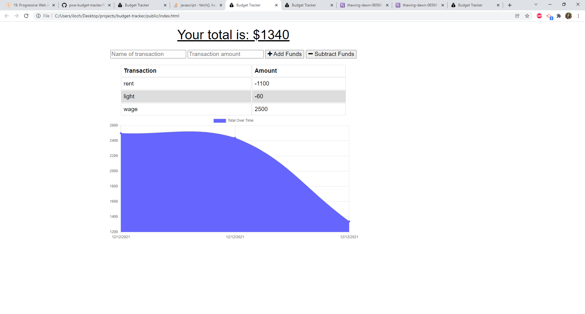

# budget-tracker

**Node Javascript Challenge**

**Version 1.15.0**

**Build an API for a budget tracker application challenge activity.**

The aim of this challenge is to update an existing budget tracker application to allow for offline access and functionality. The user will be able to add expenses and deposits to their budget with or without a connection. If the user enters transactions offline, the total should be updated when they're brought back online.

**This project follows the criteria below:**

- GIVEN a budget tracker without an internet connection, when the user inputs an expense or deposit, they will receive a notification that they have added an expense or deposit
- WHEN the user reestablishes an internet connection, then the deposits or expenses added while they were offline are added to their transaction history and their totals are updated

## Built With

- Node.js
- Express.js
- Mongoose

## Work Completed

**A successful completion of this project includes the us of the following:**

- Created models
- promises
- Use of class
- Deploy to Heroku using MondoDB

## Project Visual

- [x]Showing the originial state of the app

## Github pages and links

**This project has been deployed to GitHub Pages.** 

- [Github Repository](https://github.com/kenesei91/budget-tracker)

- [Heroku](https://thawing-dawn-06566.herokuapp.com/)

## Contributors/Contact

- Kenechukwu K Ilochonwu <keneilo91@yahoo.com>

## Licence & Copyright

© Kenechukwu K Ilochonwu, Web Project Design

Licensed under the [LICENSE] (MIT LICENSE)
